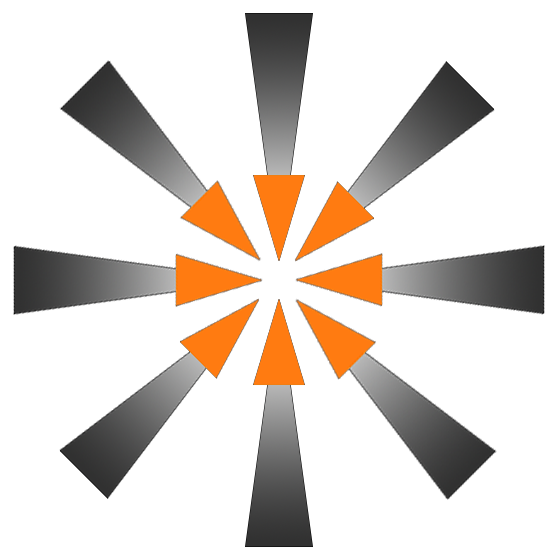

# Welcome to the Spark Engine !

 

 
 
A 3D Game Engine In C++ created using Open GL
 
<a href="https://github.com/Windokk/SparkEngine/wiki/">Wiki</a>&nbsp;&nbsp;
<a href="https://github.com/Windokk/SparkEngine/wiki/Getting-Started">Getting Started</a>&nbsp;&nbsp;
<a href="https://windokk.github.io/SparkEngineWeb/">Website</a>&nbsp;&nbsp;
<a href="https://github.com/users/Windokk/projects/1">Github Project</a>&nbsp;&nbsp;
<a href="https://trello.com/b/WwJhhFQv/spark-engine">Trello</a>

## Description

Welcome to the Spark Engine project, The Spark Engine is a powerful, C++ and OpenGL-based 3D game engine designed to provide game developers with complete control over their engine and game development process. With a commitment to empowering creativity, the Spark Engine is dedicated to fostering growth within the game industry. It enables developers to create immersive environments of various styles, including realistic, low-poly, and cell-shaded graphics, ensuring versatility and flexibility in game design.

#### Key Features:

- Full control for developers, allowing complete customization and optimization.
- Supports various graphic styles, from realistic to low poly and cell-shaded.
- Open-source and free to use, with no royalties.
- Designed to be highly accessible for game developers of all levels of expertise.
- Actively maintained and community-driven for continuous improvement and support.

#### Future Direction:
The Spark Engine is determined to embrace the latest advancements in the industry and aims to evolve into a modern ray tracing engine. With this vision, we strive to elevate our standing within the gaming industry, aspiring to reach the level of other renowned game engines like Unreal Engine and Godot.

#### Join us in our mission to revolutionize game development. Let's ignite the spark of creativity together !

> [!WARNING]
> The engine is in it's pre-alpha state of developpement so there might be a lot of bugs and incomplete features.

## Engine's code Documentation

*Working on it*

*Will be in the "docs" folder*

## To Do list (Alpha 0.0.1)

| Task          | Status        |
| ------------- | ------------- |
| 2D Shapes with Open GL  | Done     🟢   |
| 3D Simple Models  | Done 🟢   |
|Texture importing and binding|Done 🟢 |
|Camera movement|Done 🟢|
|Light management|Done 🟢|
|Specular maps implementation|Done 🟢|
|Different types of lights management|Done 🟢|
|Mesh classes|Done 🟢|
|External model importation|Done 🟢|
|Transparency and blending|Done 🟢|
|Skyboxes|Done 🟢|
|Anti-Aliasing|Done 🟢|
|Scene file (in json)|Done 🟢|
|Scene Parser Class|Done 🟢|
|Multiple Lights support|Done 🟢|
|Basic GUI implementation|Done 🟢|
|Main Menu|Done 🟢|
|Viewport Window|Done 🟢|
|Details|Done 🟢|
|Content Browser|Done 🟢|
|Outliner|Done 🟢|
|Manipluation guizmos|Done 🟢|
|Enhanced GUI|Done 🟢|
|Picking|Doing 🟠|
|Scene Creation and Saving|To do 🔴|
|Settings|To do 🔴|
|Project launcher|To do 🔴|
|Shadow maps|To do 🔴|
|Normal maps|To do 🔴|
|Bloom|To do 🔴|

## License

[GNU GPL](https://www.gnu.org/licenses/gpl-3.0.html)

## Resources Used

- Open GL with GLFW (context and window management) : [GLFW](https://www.glfw.org/)
- Open GL with Glad (OpenGL bindings and graphic card support) : [GLAD](https://glad.dav1d.de/)
- GLM (mathemical functions and types) : [GLM](https://github.com/g-truc/glm)
- Dear ImGUi (all UI) : [DEAR IMGUI](https://github.com/ocornut/imgui)

## Authors

- [@Windokk](https://github.com/Windokk)

## Feedback

If you have any feedback, please reach out to us at windokk.valorshonn@gmail.com
