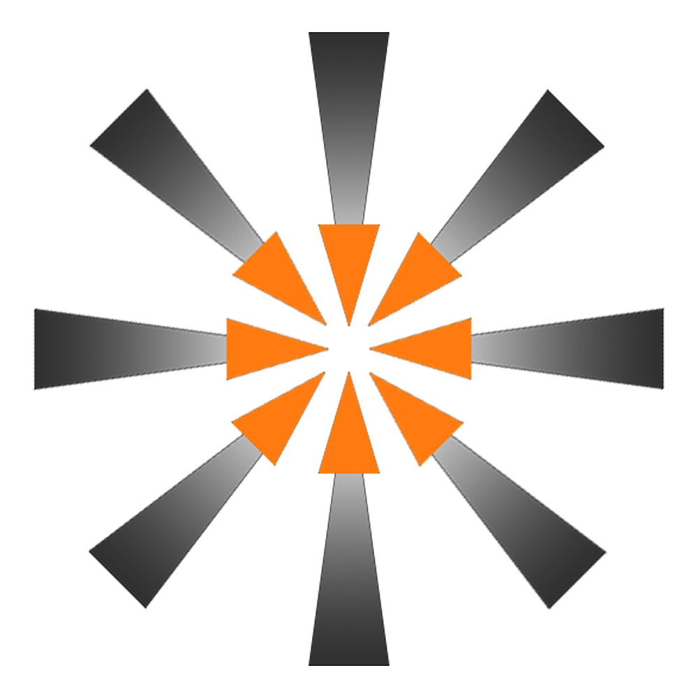

# Welcome to the Spark Engine !
   

A 3D Game Engine In C++ created as a test engine for my own portolio.

## Description
The Spark Engine is a 3D Game Engine that allows gam devs to create an environnement for a player to play in. It is created in vs code, but as it is open source, you can edit it on any IDE that you want.

It uses the Open GL [GLFW](https://www.glfw.org/) Lib for global window management, the [GLM](https://glm.g-truc.net/0.9.9/index.html) lib for all of the mathematics and the [STB](https://github.com/nothings/stb) lib for the images and textures management.

The engine is in it's pre-alpha state of developpement so there might be a lot of bugs and incomplete features.

## API/Engine Documentation

*Working on it*

*Will be in the "docs" folder*

## To Do list (Alpha 0.0.1)

| Task          | Status        |
| ------------- | ------------- |
| 2D Shapes with Open GL  | Done     🟢   |
| 3D Simple Models  | Done 🟢   |
|Texture importing and binding|Done 🟢 |
|Camera movement|Done 🟢|
|Light management|Done 🟢|
|Specular maps implementation|Done 🟢|
|Different types of lights management|Done 🟢|
|Mesh classes|Done 🟢|
|External model importation|Done 🟢|
|Transparency and blending|Done 🟢|
|Skyboxes|Done 🟢|
|Anti-Aliasing|Done 🟢|
|Scene file (in json)|Done 🟢|
|Scene Parser Class|Done 🟢|
|Multiple Lights support|Done 🟢|
|Basic GUI implementation|Done 🟢|
|Main Menu|Done 🟢|
|Viewport Window|Done 🟢|
|Details|Done 🟢|
|Content Browser|Done 🟢|
|Outliner|Done 🟢|
|Bullet Physics Engine integration|Doing 🟠|
|Picking|Doing 🟠|
|Manipluation guizmos|To do 🔴|
|Enhanced GUI|To do 🔴|
|Scene Creation and Saving|To do 🔴|
|Settings|To do 🔴|
|Project launcher|To do 🔴|
|Shadow maps|To do 🔴|
|Normal maps|To do 🔴|
|Bloom|To do 🔴|

## License

[GNU GPL](https://www.gnu.org/licenses/gpl-3.0.html)

## Resources Used

- Open GL with GLFW (context and window management) : [GLFW](https://www.glfw.org/)
- Open GL with Glad (OpenGL bindings and graphic card support) : [GLAD](https://glad.dav1d.de/)
- GLM (mathemical functions and types) : [GLM](https://github.com/g-truc/glm)
- Dear ImGUi (all UI) : [DEAR IMGUI](https://github.com/ocornut/imgui)
- Bullet Physics (Physical interactions) : [BULLET PHYSICS](https://github.com/bulletphysics/bullet3)

## Authors

- [@Windokk](https://github.com/Windokk)
